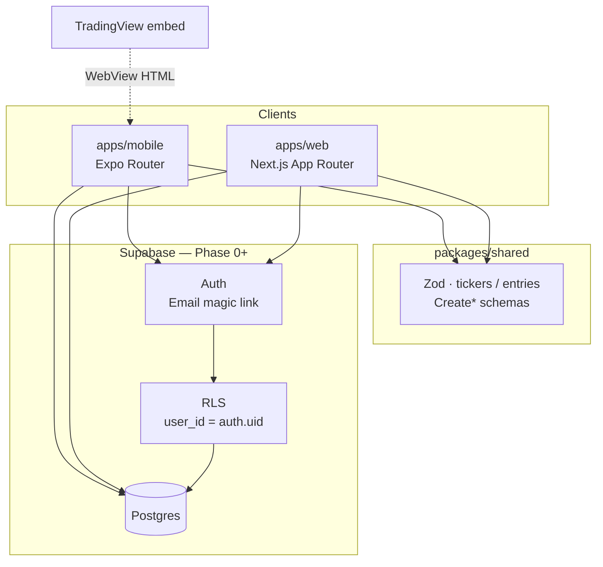
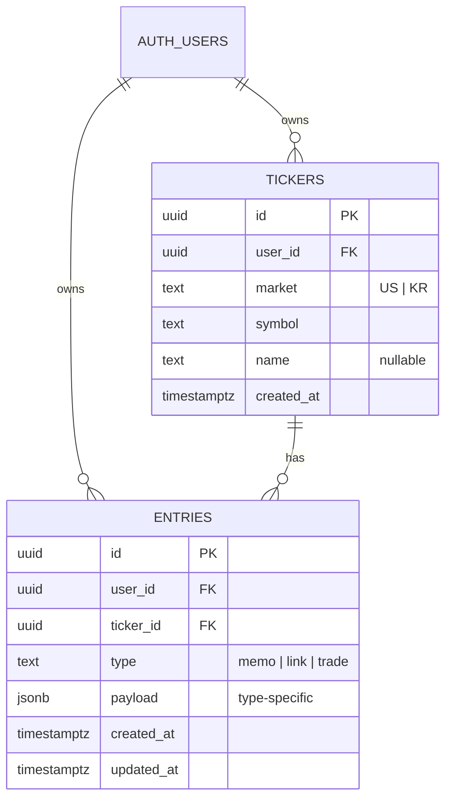
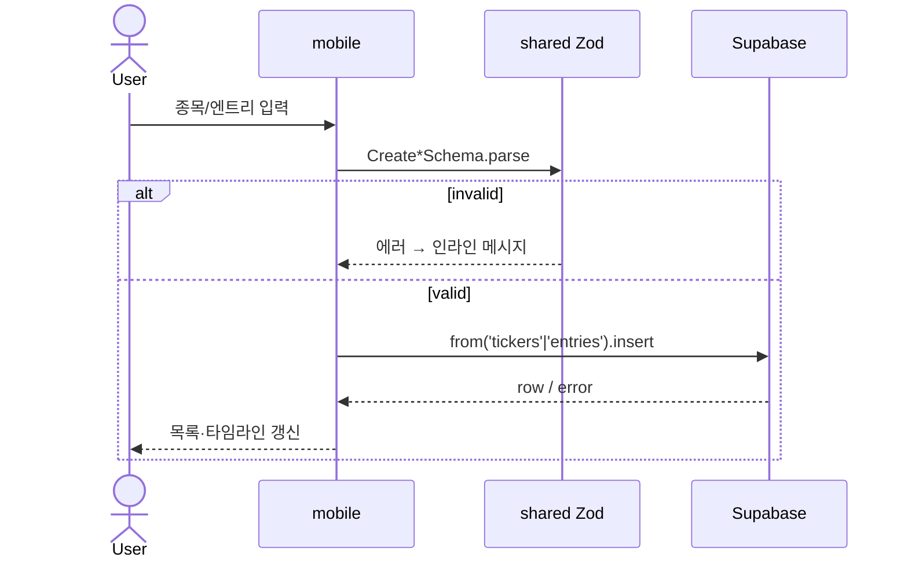

# Ticker Journal — Architecture

> Phase 0(Auth + CRUD) 들어가기 전 기준선.  
> 구현이 이 문서와 어긋나면 **코드를 고치거나 이 문서를 갱신**한다. 둘 다 하지 않은 채 두지 않는다.

| 항목 | 값 |
|------|-----|
| 상태 | Draft → Phase 0 착수 전 freeze |
| 관련 | `docs/portfolio.md`, `docs/testing.md`, `packages/shared` |
| 제품 한 줄 | 종목 단위 리서치 저널 — **모바일 입력 · 웹 검색/정리 · 동일 계정** |

---

## 1. 목표 / 비목표

### 목표 (MVP Success)

- 관심종목을 만들고, 종목별 타임라인에 `memo` / `link` / `trade`를 남긴다.
- 차트는 TradingView(또는 동등 embed)를 **WebView**로 본다.
- 앱·웹이 **같은 Supabase 계정·DB**를 쓴다.
- 최종 성공 조건은 Phase 2 **App Store + Play Store** 라이브 (이력서 신호).

### 의도적으로 하지 않음

| 제외 | 이유 |
|------|------|
| 브로커 연동 / 자동 체결 동기화 | Tradervue급 범위 폭발 |
| 실시간 호가·주문 UI | 제품 쐐기가 아님 (리서치 저널) |
| AI 주간 브리핑 | v2 |
| 공유 시트 | v1.1 |
| 웹에서 주 입력 UX | Phase 0은 **모바일 CRUD** 우선, 웹은 Phase 1 검색 |

---

## 2. 고수준 시스템



**신뢰 경계**

- DB 접근은 클라이언트 → Supabase만. 커스텀 API 서버 없음 (Phase 0~1).
- 권한은 **RLS**가 최종 방어선. 클라이언트 필터만으로 보안을 가정하지 않는다.
- `packages/shared` Zod는 **입력 검증·타입 계약**. RLS를 대체하지 않는다.

---

## 3. 모노레포 레이아웃

```
ticker-journal/
├── apps/
│   ├── mobile/     # Expo Router — 입력·타임라인·차트 WebView
│   └── web/        # Next.js — 검색·아카이브 (Phase 1+)
├── packages/
│   └── shared/     # Zod 스키마 + 공통 상수 (APP_NAME 등)
├── docs/           # portfolio / testing / architecture
├── pnpm-workspace.yaml
└── turbo.json
```

| 패키지 | 책임 | 비책임 |
|--------|------|--------|
| `@ticker-journal/mobile` | 관심종목·엔트리 CRUD UI, Auth 세션, WebView 차트 | 웹 SEO, 서버 렌더 검색 |
| `@ticker-journal/web` | 랜딩 → Phase 1 검색/상세 | 네이티브 제스처·스토어 빌드 |
| `@ticker-journal/shared` | 도메인 스키마·타입·순수 헬퍼 | React 컴포넌트, Supabase 클라이언트 인스턴스 |

### 빌드 연결

- **Turborepo**: `build` / `typecheck` / `test`는 `^build`로 shared 선행.
- **Next**: `transpilePackages: ["@ticker-journal/shared"]`.
- **Expo Metro**: workspace root `watchFolders` + hoisted `nodeModulesPaths` (`.npmrc` `node-linker=hoisted`).

shared는 `main`/`types`가 `dist/`를 가리키므로 **앱 실행 전 `pnpm --filter @ticker-journal/shared build`** (또는 turbo 의존으로 자동).

---

## 4. 클라이언트 역할 분담

### 4.1 Mobile (`apps/mobile`) — Phase 0 주전장

| 화면 | 경로 | Phase 0 범위 |
|------|------|----------------|
| 관심종목 | `app/index.tsx` | 목록 + 추가/삭제 (실데이터) |
| 종목 상세 | `app/ticker/[id].tsx` | WebView 차트 + 타임라인 + FAB로 엔트리 추가 |
| Auth | (추가 예정) | 매직링크 로그인 / 세션 / 로그아웃 |

**네비게이션**: Expo Router Stack (`관심종목` → `종목`).

**차트 정책**

- US: TradingView symbol embed (WebView HTML).
- KR: embed 미지원·불안정 시 **fallback UI** (심볼·안내 문구). 차트 라이브러리 네이티브 포팅은 하지 않음.

### 4.2 Web (`apps/web`) — Phase 1

| 화면 | Phase |
|------|-------|
| 랜딩 / 아카이브 안내 | 스캐폴드 (현재) |
| 매직링크 로그인 | Phase 1 (앱과 동일 Supabase 프로젝트) |
| entries 검색 (`q`, page size 20) | Phase 1 |
| 종목 상세 + TradingView | Phase 1 |

Phase 0 동안 웹은 **스키마·디자인 계약만 맞춤**. 필수는 아님.

---

## 5. 도메인 모델

- 소스 오브 트루스: `packages/shared/src/index.ts`.
- Supabase `Database` 타입: `packages/shared/src/database.ts` (웹·모바일 공용). 스키마 변경 후 `pnpm gen:types`로 재생성.

### 5.1 ER



### 5.2 Entry 페이로드 (앱 계약)

| type | 필수 | 선택 |
|------|------|------|
| `memo` | `body` | — |
| `link` | `url` | `title`, `note` |
| `trade` | `side` (`buy`\|`sell`), `traded_at` | `price`, `qty`, `reason` |

타임라인 필터: `all` | `memo` | `link` | `trade` (`TimelineFilterSchema`).

### 5.3 Postgres 권장 스키마 (Phase 0 마이그레이션)

```sql
-- 의사코드. 실제 마이그레이션은 supabase/migrations 에 둔다.

create type market as enum ('US', 'KR');
create type entry_type as enum ('memo', 'link', 'trade');
create type trade_side as enum ('buy', 'sell');

create table public.tickers (
  id uuid primary key default gen_random_uuid(),
  user_id uuid not null references auth.users (id) on delete cascade,
  market market not null,
  symbol text not null,
  name text,
  created_at timestamptz not null default now(),
  unique (user_id, market, symbol)
);

create table public.entries (
  id uuid primary key default gen_random_uuid(),
  user_id uuid not null references auth.users (id) on delete cascade,
  ticker_id uuid not null references public.tickers (id) on delete cascade,
  type entry_type not null,
  -- 타입별 컬럼 (jsonb 단일 컬럼 대신 명시 컬럼 권장 — 검색·체크 제약 쉬움)
  body text,
  url text,
  title text,
  note text,
  side trade_side,
  traded_at timestamptz,
  price numeric,
  qty numeric,
  reason text,
  created_at timestamptz not null default now(),
  updated_at timestamptz not null default now(),
  constraint entries_payload_check check (
    (type = 'memo'  and body is not null) or
    (type = 'link'  and url is not null) or
    (type = 'trade' and side is not null and traded_at is not null)
  )
);

create index entries_ticker_created_idx on public.entries (ticker_id, created_at desc);
create index entries_user_created_idx on public.entries (user_id, created_at desc);
-- Phase 1 검색용: body / title / note / reason 에 대한 FTS 또는 ilike 인덱스 검토
```

**심볼 규칙**: 클라이언트에서 `trim` + `UPPER` (`CreateTickerSchema`). DB에도 동일 정규화 저장.

---

## 6. Auth & 보안

### Auth

- Provider: **Supabase Auth** — 이메일/비밀번호 + 매직링크 + Google OAuth.
- 모바일: `detectSessionInUrl: false` + `Linking` 콜백에서 `exchangeCodeForSession` / `setSession`. redirect는 `Linking.createURL('auth/callback')`. Google은 `skipBrowserRedirect` + `WebBrowser.openAuthSessionAsync`.
- 웹: `@supabase/ssr` 쿠키. 콜백·세션 갱신(쿠키 set) 응답에 no-cache 헤더를 붙인다. `next` 쿼리는 상대 경로만 허용(`//`, `/\` 차단).
- 회원가입: 이메일/비밀번호 (확인 메일 발송). 매직링크는 기존 계정 로그인 전용.
- Google OAuth: Supabase Dashboard에서 Google provider 활성화 필요.
- 로그아웃·계정 삭제 경로는 Phase 2 스토어 심사 전에 필수 (빈 상태·에러와 함께).

### RLS (필수)

```text
tickers:  SELECT/INSERT/UPDATE/DELETE  WHERE user_id = auth.uid()
entries:  SELECT/INSERT/UPDATE/DELETE  WHERE user_id = auth.uid()
entries INSERT/UPDATE: ticker_id 가 본인 tickers 행이어야 함 (존재 + user_id 일치)
```

서비스 롤 키는 **앱에 넣지 않는다**. anon key + RLS만.

### 환경 변수

| 변수 | 사용처 |
|------|--------|
| `EXPO_PUBLIC_SUPABASE_URL` | mobile |
| `EXPO_PUBLIC_SUPABASE_KEY` | mobile (publishable / anon) |
| `NEXT_PUBLIC_SUPABASE_URL` | web |
| `NEXT_PUBLIC_SUPABASE_ANON_KEY` | web |

값은 동일 Supabase 프로젝트. 템플릿: `.env.example`.

---

## 7. 데이터 접근 패턴 (Phase 0)



**규칙**

1. UI → Zod parse → Supabase. raw insert 금지.
2. 목록/타임라인은 `user_id`를 쿼리에 넣지 않아도 됨 (RLS). 명시해도 무방.
3. 낙관적 업데이트는 선택. 실패 시 롤백·토스트.
4. Supabase 클라이언트 싱글톤은 **앱 패키지 안** (`lib/supabase.ts`). shared에 두지 않음.

---

## 8. 테스트 아키텍처

상세: `docs/testing.md`.

| 계층 | 위치 | 도구 |
|------|------|------|
| 도메인 | `packages/shared` | Vitest |
| 웹 컴포넌트 | `apps/web` | Vitest + RTL |
| 웹 E2E | `apps/web/e2e` | Playwright |
| 모바일 단위 | `apps/mobile` | jest-expo (`buildChartHtml`) |
| 모바일 화면 | (예정) Maestro | E2E |

Phase 0 추가 권장:

- shared: Create* / payload check 케이스 보강
- 모바일 화면: Maestro 스모크 (라우터 mock 컴포넌트 테스트는 하지 않음)
- (나중) Maestro/Detox 스토어 전 스모크

---

## 9. 페이즈별 아키텍처 경계

| Phase | 아키텍처 산출물 | 완료 정의 |
|-------|-----------------|-----------|
| **0** | Supabase 프로젝트, migrations, RLS, mobile Auth+CRUD, US 차트 embed | 본인 계정으로 종목·엔트리 CRUD end-to-end |
| **1** | web Auth, 검색 API/쿼리, 상세 페이지 | `q` 검색 page size 20, 앱과 동일 데이터 |
| **2** | EAS Build, 스토어 메타, 심사 경로 | iOS+Android 라이브 URL |
| **v1.1 / v2** | 공유 시트 / AI 브리핑 | 별도 ADR |

---

## 10. ADR (결정 기록)

### ADR-001: B-lite 모노레포

- **결정**: Expo + Next + shared Zod를 한 레포.
- **이유**: 스키마 한곳, 풀스택·모바일 이력서 한 줄, 스토어+웹 동시 진화.
- **대안 기각**: WebView 래퍼만(Approach C) — RN 깊이 부족.

### ADR-002: 백엔드는 Supabase only

- **결정**: Phase 0~1에서 커스텀 Node API 없음.
- **이유**: Auth+Postgres+RLS로 CRUD에 충분, 운영 면적 최소.
- **재검토 시점**: 서버 전용 시크릿·크론·AI 브리핑(v2).

### ADR-003: 차트는 WebView

- **결정**: TradingView embed HTML in WebView.
- **이유**: 네이티브 차트 공수 대비 가치 낮음. KR은 fallback.
- **재검토 시점**: 오프라인·커스텀 오버레이 필수해질 때.

### ADR-004: 테스트 러너 이원화

- **결정**: shared/web = Vitest, mobile = Jest.
- **이유**: Expo 공식·모킹 경로가 Jest. 통일 비용 > 이원 비용.
- **문서**: `docs/testing.md`.

### ADR-005: Entry는 타입별 컬럼 + check

- **결정**: jsonb 단일 blob 대신 명시 컬럼 + `entries_payload_check`.
- **이유**: Phase 1 검색·제약·가독성. Zod discriminated union과 1:1 매핑 쉬움.

---

## 11. Phase 0 착수 체크리스트

구현 시작 전/중 이 목록을 닫는다.

- [x] Supabase 프로젝트 생성, `.env` 채움 (example 기준) — **로컬 키는 사용자 환경**
- [x] `supabase/migrations` 에 tickers/entries + RLS
- [x] mobile `lib/supabase.ts` + Auth 화면/세션 게이트
- [x] 관심종목 CRUD (placeholder 제거)
- [x] 엔트리 CRUD + 필터 칩 동작
- [x] US TradingView WebView / KR fallback
- [x] shared·mobile 테스트 갱신
- [x] `docs/portfolio.md` · `docs/resume-bullets.md` 갱신
- [x] GitHub Actions CI (`check` / `typecheck` / `test` / Playwright E2E)

---

## 12. 갱신 로그

| 날짜 | 내용 |
|------|------|
| 2026-08-13 | Phase 0 전 기준선 문서 초안 작성 |
| 2026-08-15 | Auth/CRUD 테스트 보강, GitHub Actions CI 추가 |
| 2026-08-15 | 모바일 매직링크 콜백·웹 세션 캐시 헤더 반영 |
| 2026-08-19 | 이메일/비번 회원가입·로그인 + Google OAuth 추가 |
| 2026-08-20 | 콜백 open-redirect·세션 캐시 헤더·entries UPDATE ticker 소유권·모바일 Google WebBrowser |
