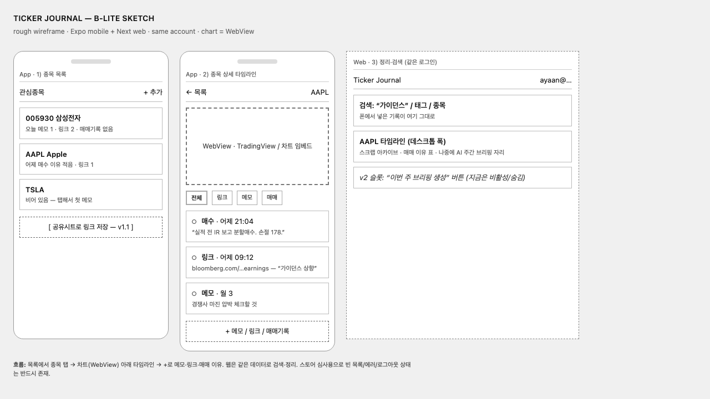
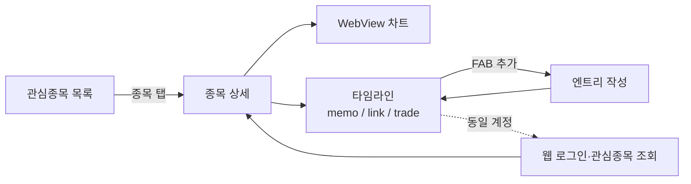
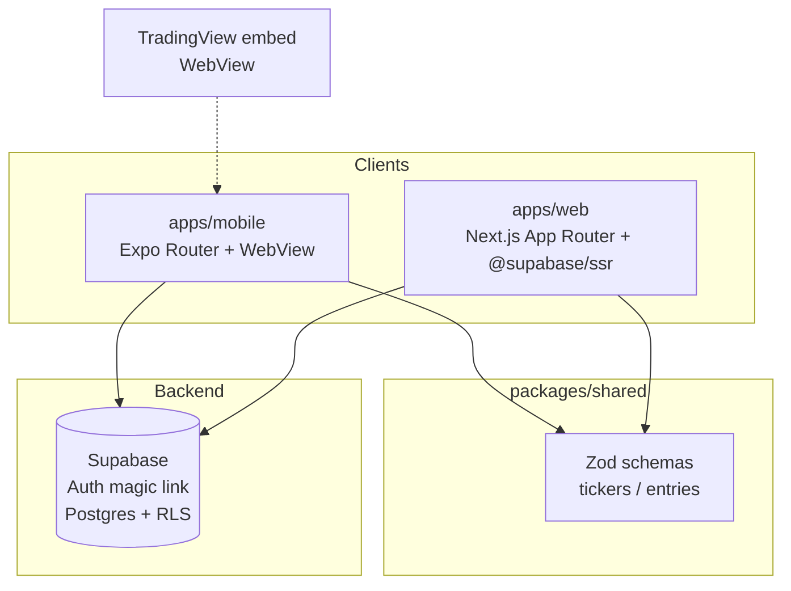
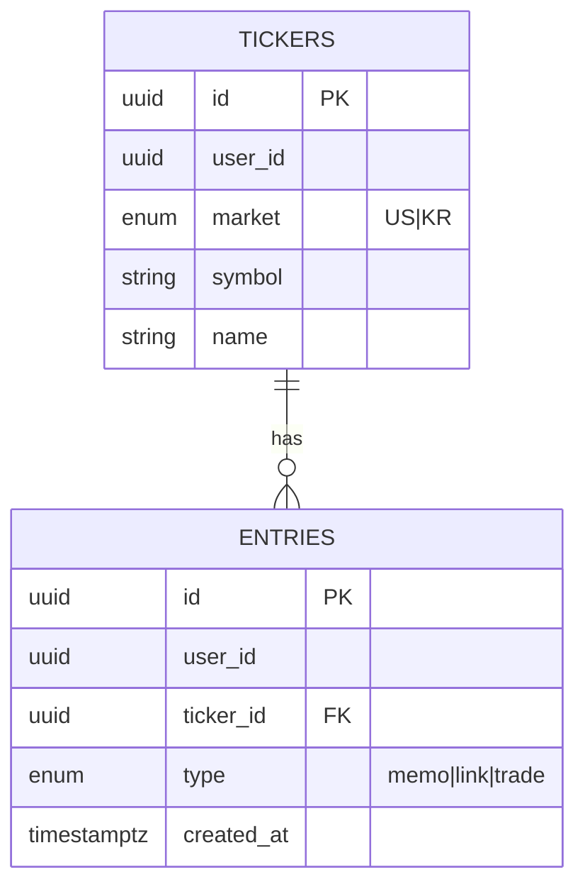
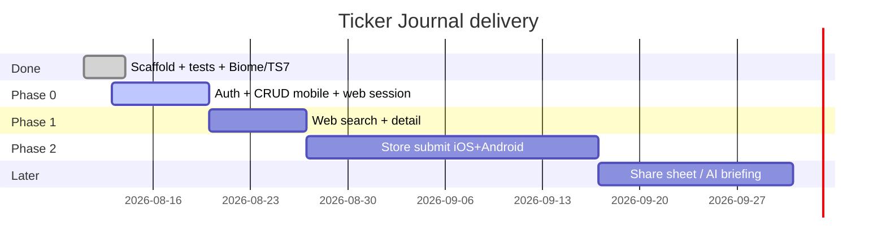
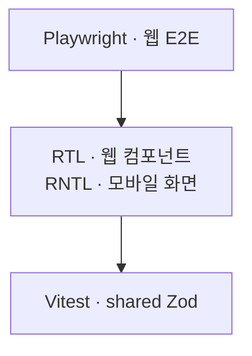

# Ticker Journal — 포트폴리오

> 목적: 이력서/포트폴리오에 붙일 **과정 · 어려웠던 점 · 배운 점** + **다이어그램** 기록.  
> 기능 구현이 끝날 때마다 이 문서와 아래 그림을 갱신한다. (`/.cursor/rules/portfolio-docs.mdc`)

| 항목 | 내용 |
|------|------|
| 기간 | 2026-08 ~ (진행 중) |
| 역할 | 개인 프로젝트 (기획 · 설계 · 풀스택 · 모바일 · 배포) |
| 스택 | Expo (React Native), Expo Router, Next.js 16, TypeScript 7, Zod, pnpm monorepo, Turborepo, Biome, WebView, Vitest, RTL, jest-expo, Playwright, Supabase (Auth + Postgres + RLS), (예정) EAS Submit |
| 레포 | https://github.com/scs0209/ticker-journal |
| 설계 문서 | `docs/design.md` · `docs/architecture.md` |
| 현재 브랜치 | `feat/phase-0-auth-crud` |

---

## 한 줄 요약

노션·시트에 흩어진 주식 리서치·매매 이유를 **종목 타임라인**으로 묶고, **모바일에서 입력 · 웹에서 동일 계정으로 확인**하며, **App Store / Play Store**까지 가는 크로스플랫폼 앱.

---

## 0. 시각 자료 (포트폴리오용)

### 0.1 와이어프레임 (MVP 3화면)

앱 관심종목 → 종목 상세(WebView 차트 + 타임라인) → 웹 검색/아카이브.

HTML 스케치: [`assets/ticker-journal-wireframe.html`](./assets/ticker-journal-wireframe.html)

### 0.2 유저 플로우

### 0.3 시스템 아키텍처

### 0.4 데이터 모델

- `memo`: body  
- `link`: url (+ title, note)  
- `trade`: side, traded_at (+ price, qty, reason)

### 0.5 로드맵

### 0.6 테스트 계층

| 영역 | 도구 | 역할 |
|------|------|------|
| shared | Vitest | 스키마·도메인 규칙 (**7**) |
| web | Vitest + RTL | UI 계약 (**2**) |
| web | Playwright | 브라우저 플로우 (**1**) |
| mobile | jest-expo + RNTL | 화면·차트 HTML (**3**) |

---

## 1. 과정 (Process)

### 1.1 문제 정의

- 학습 목표: React Native를 “만들면서” 배우기 + 이력서에 모바일·스토어 배포 어필
- 실제 불편: 관심 종목 관련 링크/메모/매매 이유가 노션·메모장·시트에 분산
- 제품 쐐기: **종목 단위 리서치 저널** (스크랩 + 매매 기록 타임라인)
- 의도적으로 하지 않은 것: Tradervue식 브로커 연동·승률 SaaS (범위 폭발 방지)

### 1.2 설계 결정 (Office Hours)

- Learning + Having fun + 이력서 신호로 목표 고정
- **B-lite** 채택: 모노레포, MVP 얇게, 스토어 둘 다
- WebView 래퍼만(Approach C) 기각 — 면접 “RN 얼마나?” 리스크
- AI 주간 브리핑은 v2, 차트는 WebView, 스토어 등록이 성공 조건

### 1.3 스캐폴드 (2026-08-11)

- pnpm + Turborepo, Expo Router, Next 랜딩, shared Zod
- Metro / `transpilePackages` 연결, typecheck·Next build 통과

### 1.4 테스트 계층 (2026-08-11)

- 위 **0.6** 참고. 상세: `docs/testing.md`

### 1.5 아키텍처 freeze · 툴링 (2026-08-13)

- Phase 0 기준선: `docs/architecture.md` (모노레포 · Supabase/RLS · 도메인 · ADR)
- Biome 2.5.7 (3d-blog 정렬), TypeScript **7.0.2**, pnpm overrides → `pnpm-workspace.yaml`

### 1.6 Phase 0 — Auth + CRUD (2026-08-13, `feat/phase-0-auth-crud`)

**백엔드**

- `supabase/migrations/..._init.sql`: `tickers` / `entries`, enum, check 제약, RLS (`user_id = auth.uid()`)

**모바일**

- 매직링크 로그인 (`expo-secure-store` 세션), 로그인 게이트
- 관심종목 CRUD, 엔트리(memo/link/trade) CRUD + 타임라인 필터
- US TradingView WebView / KR fallback HTML

**웹**

- `@supabase/ssr` + Next 16 `proxy.ts` 세션 갱신
- `/login` 매직링크, `/auth/callback` 코드 교환
- 홈에서 동일 계정 관심종목 조회 (검색·상세는 Phase 1)

### 1.7 이후 로드맵

- [x] Phase 0: Supabase Auth + 모바일 CRUD + 웹 세션/목록 (`feat/phase-0-auth-crud`)
- [ ] Phase 1: 웹 entries 검색·종목 상세
- [ ] Phase 2: EAS → App Store / Play Store
- [ ] v1.1 공유 시트 / v2 AI 브리핑

---

## 2. 어려웠던 점 (Challenges)

| 시점 | 어려움 | 대응 |
|------|--------|------|
| 기획 | Todo 클론 vs 주식 SaaS 범위 폭발 | 노션+시트 구멍만 제품화 |
| 아키텍처 | WebView 래퍼 감점 위험 | 네이티브 셸 + WebView 차트 |
| 성공 조건 | 내부 배포만으론 이력서 신호 약함 | 양 스토어를 Success Criteria로 |
| 모노레포 | 앱별 lock/workspace 충돌 | 루트 workspace만 유지 |
| 테스트 | React 19.2.3 vs react-dom 19.2.8 → RTL 빈 DOM | overrides로 정렬 (`pnpm-workspace.yaml`) |
| RN 테스트 | Vitest 통일 유혹 | mobile만 jest-expo + RNTL |
| Phase 0 | Supabase 없이 앱만 만들면 E2E 검증 불가 | 마이그레이션·RLS·env를 코드와 같이 고정 |
| Next 16 | `middleware` deprecation | `proxy.ts`로 세션 갱신 이전 |
| Auth | 모바일/웹 redirect URL이 다름 | `tickerjournal://…` + `localhost:3000/auth/callback` 둘 다 등록 |

---

## 3. 배운 점 (Learnings)

- 포트폴리오 모바일은 **배포·네이티브 표면 + 수치**가 기능 나열보다 세다.
- 경쟁 상대는 Tradervue가 아니라 **노션+시트 분산**.
- 모노레포 공유 Zod + RLS = “클라이언트가 달라도 권한 모델은 하나”.
- React 버전 불일치는 RTL이 **조용히 빈 트리**를 그린다.
- 다이어그램을 문서에 두면 면접·노션 포트폴리오에 바로 붙일 수 있다.
- **문서 동기화**: 코드 마일스톤마다 `portfolio.md` / `resume-bullets.md`를 같이 갱신하지 않으면 이력서 문장이 코드보다 뒤처진다.
- Next 16에서는 edge 세션 갱신을 `proxy` 컨벤션으로 맞추는 편이 경고·미래 호환에 유리하다.

---

## 4. 포트폴리오 본문 초안 (복붙용)

### 프로젝트 소개

Ticker Journal은 주식 리서치 스크랩과 매매 이유를 종목 타임라인으로 관리하는 크로스플랫폼 앱입니다. Expo 모바일에서 입력하고, Next.js 웹에서 같은 Supabase 계정으로 관심종목을 확인합니다.

### 내가 한 일

- 문제 정의·MVP 3화면 와이어프레임·아키텍처/ADR 문서화
- pnpm/Turborepo 모노레포 (`mobile` / `web` / `shared`) + Biome + TypeScript 7
- Expo Router · 매직링크 Auth · 관심종목/엔트리 CRUD · TradingView WebView
- Next.js `@supabase/ssr` 로그인·콜백·관심종목 조회
- Postgres 스키마 + RLS, Zod 공유 스키마로 입력 검증
- Vitest / RTL / Playwright / jest-expo 테스트 계층 (**13+** 케이스)
- (예정) entries 웹 검색, 스토어 2곳 배포

### 성과 / 임팩트

- 앱·웹 **동일 Supabase 계정**으로 Auth + 종목 목록 동기화 경로 확보
- *(실사용 종목 N·주간 entry M, 스토어 URL — `docs/resume-bullets.md` 지표 표)*

---

## 5. 갱신 로그

| 날짜 | 무엇이 바뀌었나 |
|------|----------------|
| 2026-08-11 | 설계 승인, 모노레포 스캐폴드, 이 문서 최초 작성 |
| 2026-08-11 | Vitest/RTL/Playwright + jest-expo 테스트 계층 추가, React 버전 충돌 해결 |
| 2026-08-11 | 이력서 문구를 수치·임팩트 지표 중심으로 재작성 |
| 2026-08-11 | 와이어프레임·머메이드(플로우/아키텍처/ER/로드맵/테스트) 섹션 추가 |
| 2026-08-13 | Phase 0 전 `docs/architecture.md` 기준선 추가 |
| 2026-08-13 | Biome · TypeScript 7 도입 |
| 2026-08-13 | Phase 0: migrations/RLS, 모바일 Auth·CRUD·차트, 웹 세션·관심종목 조회 |
| 2026-08-14 | office-hours 설계 문서를 `docs/design.md`로 레포에 포함 |
